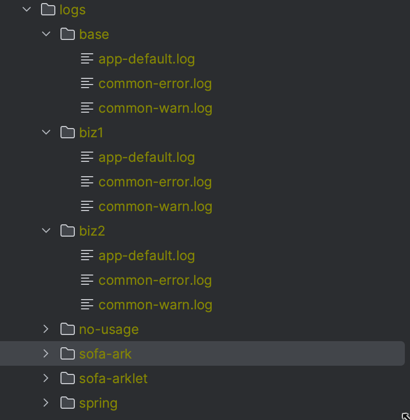

# log4j2 多应用分别打印不同目录
原理详看[这里](https://github.com/sofastack/sofa-serverless/blob/master/docs/content/zh-cn/docs/contribution-guidelines/runtime/logj42.md)

# 实验内容
## 实验应用
### base
base 为普通 springboot 改造成的基座，改造内容为在 pom 里增加如下依赖
```xml


<!-- 这里添加动态模块相关依赖 -->
<!--    务必将次依赖放在构建 pom 的第一个依赖引入, 并且设置 type= pom, 
    原理请参考这里 https://sofaserverless.gitee.io/docs/contribution-guidelines/runtime/multi-app-padater/ -->
<dependency>
    <groupId>com.alipay.sofa.serverless</groupId>
    <artifactId>sofa-serverless-base-starter</artifactId>
    <version>${sofa.serverless.runtime.version}</version>
    <type>pom</type>
</dependency>
<!-- end 动态模块相关依赖 -->

<!-- 这里添加 tomcat 单 host 模式部署多web应用的依赖 -->
<dependency>
    <groupId>com.alipay.sofa</groupId>
    <artifactId>web-ark-plugin</artifactId>
</dependency>
<!-- end 单 host 部署的依赖 -->

<!-- log4j2 相关依赖 -->
<dependency>
    <groupId>org.springframework.boot</groupId>
    <artifactId>spring-boot-starter-log4j2</artifactId>
</dependency>

<!-- log4j2 异步队列 -->
<dependency>
    <groupId>com.lmax</groupId>
    <artifactId>disruptor</artifactId>
    <version>${disruptor.version}</version>
</dependency>
<dependency>
    <groupId>com.alipay.sofa.serverless</groupId>
    <artifactId>sofa-serverless-log4j2-starter</artifactId>
    <version>${sofa.serverless.runtime.version}</version>
</dependency>
<!-- end log4j2 依赖引入 -->

```

### biz
biz 包含两个模块，分别为 biz1 和 biz2, 都是普通 springboot，修改打包插件方式为 sofaArk biz 模块打包方式，打包为 ark biz jar 包，打包插件配置如下：
```xml
<!-- 模块需要引入专门的 log4j2 adapter -->
<dependency>
    <groupId>com.alipay.sofa.serverless</groupId>
    <artifactId>sofa-serverless-adapter-log4j2</artifactId>
    <version>${sofa.serverless.runtime.version}</version>
    <scope>provided</scope>
</dependency>

<!-- 修改打包插件为 sofa-ark biz 打包插件，打包成 ark biz jar -->
<plugin>
    <groupId>com.alipay.sofa</groupId>
    <artifactId>sofa-ark-maven-plugin</artifactId>
    <version>${sofa.ark.version}</version>
    <executions>
        <execution>
            <id>default-cli</id>
            <goals>
                <goal>repackage</goal>
            </goals>
        </execution>
    </executions>
    <configuration>
        <skipArkExecutable>true</skipArkExecutable>
        <outputDirectory>./target</outputDirectory>
        <bizName>${bizName}</bizName>
        <!-- 单host下需更换 web context path -->
        <webContextPath>${bizName}</webContextPath>
        <declaredMode>true</declaredMode>
    </configuration>
</plugin>
```
注意这里将不同 biz 的web context path 修改成不同的值，以此才能成功在一个 tomcat host 里安装多个 web 应用。


## 实验任务
### 执行 mvn clean package -DskipTests
可在各 bundle 的 target 目录里查看到打包生成的 ark-biz jar 包
### 启动基座应用 base，确保基座启动成功
### 执行 curl 命令安装 biz1 和 biz2
```shell
curl --location --request POST 'localhost:1238/installBiz' \
--header 'Content-Type: application/json' \
--data '{
    "bizName": "biz1",
    "bizVersion": "0.0.1-SNAPSHOT",
    // local path should start with file://, alse support remote url which can be downloaded
    "bizUrl": "file:///path/to/springboot-samples/samples/web/tomcat/biz1/target/biz1-log4j2-0.0.1-SNAPSHOT-ark-biz.jar"
}'
```

```shell
curl --location --request POST 'localhost:1238/installBiz' \
--header 'Content-Type: application/json' \
--data '{
    "bizName": "biz2",
    "bizVersion": "0.0.1-SNAPSHOT",
    // local path should start with file://, alse support remote url which can be downloaded
    "bizUrl": "file:///path/to/springboot-samples/samples/web/tomcat/biz2/target/biz2-log4j2-0.0.1-SNAPSHOT-ark-biz.jar"
}'
```

如果想验证卸载也可以执行
```shell
curl --location --request POST 'localhost:1238/uninstallBiz' \
--header 'Content-Type: application/json' \
--data '{
    "bizName": "biz1",
    "bizVersion": "0.0.1-SNAPSHOT"
}'
```

### 发起请求验证
```shell
curl http://localhost:8080/biz1
```
返回 `hello to /biz1 deploy`


```shell
curl http://localhost:8080/biz2
```
返回 `hello to /biz2 deploy`

### 查看日志打印是否正常
1. 检查内容1, 控制台里能看到模块启动时的日志


2. 检查内容2, `./samples/logging/log4j2/logs/` 目录里的日志分布在符合如下情况


- biz1 的应用日志在 `./samples/logging/log4j2/logs/biz1/` 目录下
- biz2 的应用日志在 `./samples/logging/log4j2/logs/biz2/` 目录下
- base 的应用日志在 `./samples/logging/log4j2/logs/base/` 目录下
- biz1, biz2, base 的框架日志(如 spring sofaArk arklet等)，统一合并在同一个目录文件里


## 注意事项
这里主要使用简单应用做验证，如果复杂应用，需要注意模块做好瘦身，基座有的依赖，模块尽可能设置成 provided，尽可能使用基座的依赖。
